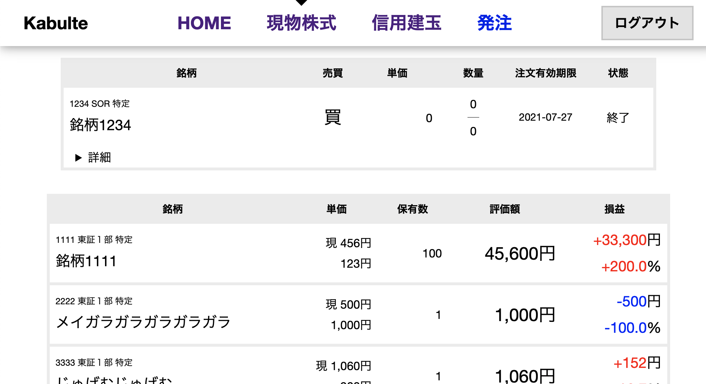

# kabulte

- Sveltekit を使ってみるテスト
- Kabu Station API を使ってみるテスト
- API を通じた取引手数料が無料になるのを楽しむテスト

無保証です。

コードはとても小さいので、詳しくは読んでください。

# 説明

## 対象

- ある程度近代的なブラウザを前提としています。IE11 では動作しません。
- localhost にある kabu ステーションと通信します。

## できること

できるよりできないことの方が多いので、できることを書きます。

- HOME
  - 取引余力(現物)
  - 信用新規可能額
- 現物株式
  - 保有現物株式一覧
- 信用建玉
  - 信用建玉一覧
  - 信用注文一覧

やりたいこと

- 信用注文 (ただし一般信用売・制度信用買・現引・現渡のみ)
- 注文取消

やらなさそうなこと

- 先物・オプションは利用していないので対応していません。

## Kabu Station API とは

https://kabu.com/company/lp/lp90.html
au カブコム証券での API インターフェイスです。

API 使用者はクライアントソフト(kabu ステーション)を PC で起動し、そのクライアントソフトの起動・ログインで証券会社への接続を確立します。
API はこのクライアントソフトへの接続して利用します。

つまり、このプログラムで用いられる API Key は、手元の PC で動作している kabu ステーションへの接続のためのものです。

このテストコードは、上の仕組みを前提としています。html 自身はどこでホストしても構いませんが、API は localhost へと通信しています。
(同じ PC がホストしているとは限らないため CORS としています)

## OpenAPI

OpenAPI の定義ファイルはありますが、TypeScript の良さが感じられるコードが出力されなさそうなので、使っていません。
手作業で定義したものが lib/api にあります。意外と分量が増え、後悔しています。

## SessionStorage/Cookie

- API Token は利用可能であれば SessionStorage、利用できない場合は Cookie に保存しています。
- 利便性のために API Password を保持するのが一番嬉しいですが、これは保持していません。
- API Token は早朝の kabu ステーションの自動ログアウトに伴い無効化されるので、毎日一度は手動でログインする必要があります。

## LoginState

- ログイン状態の保持・購読を login_state.ts で writable (Svelte ストア)を使って実現しています。
- 未ログイン状態の場合は、\_\_layout.svelte で Login.svelte を用いログイン用 Modal Popup を表示します。
- ログイン状態は login_state.ts で subscribe して各ページで取得しています。
  - ログイン状態の場合は API を呼び出しています。
  - API を呼び出した結果 API Key が無効だと判断できた場合は、login_state.ts の logout を呼び出し、未ログイン状態にします。
  - 未ログイン状態の場合は前述のように Login.svelte はログイン用 Modal Popup を表示します。

## ブラウザでの実行に制限する

- 開発中に SSR でサーバーでの実行を防ぐために、`import { browser } from '$app/env';` からの `if (browser)` で分岐しています。
- もっと良い方法があれば教えてください。
